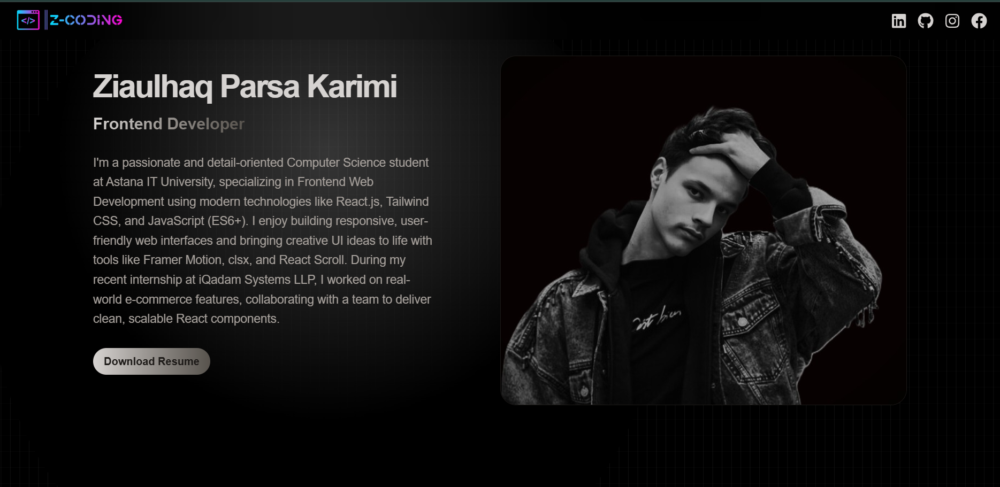

# React Portfolio

A modern, responsive portfolio website built with React. Showcase your projects, skills, and experience in a visually appealing and interactive way.

## Features
- Responsive design for all devices
- Project showcase with images
- About, Experience, Technologies, and Contact sections
- Easy to customize and extend

## Screenshots


## Demo
https://parsa-professional-portfolio.vercel.app/ 

## Getting Started

### Prerequisites
- Node.js (v14 or higher recommended)
- npm or yarn

### Installation
1. Clone the repository:
   ```bash
   git clone https://github.com/your-username/your-portfolio.git
   cd react-portfolio
   ```
2. Install dependencies:
   ```bash
   npm install
   # or
   yarn install
   ```

### Running Locally
Start the development server:
```bash
npm run dev
# or
yarn dev
```
Open [http://localhost:5173](http://localhost:5173) to view it in your browser.

### Building for Production
```bash
npm run build
# or
yarn build
```
## Technologies Used
- React
- Vite
- JavaScript (ES6+)
- CSS3

